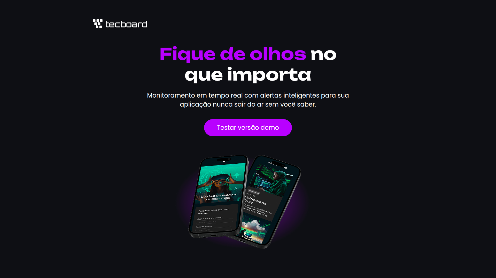

# Project-TecBoard - Adaptive 🖥️

Um projeto de estudo focado na criação de um "techboard" (painel de tecnologia) simples, com o objetivo principal de aplicar e aprofundar conceitos de **HTML5** e **CSS3**. O maior desafio e foco deste projeto foi garantir que o layout fosse totalmente **adaptativo (responsivo)**, funcionando de forma agradável tanto em desktops quanto em dispositivos móveis.


---

## 📸 Screenshots

Aqui você pode ver como o projeto se parece em diferentes tamanhos de tela, demonstrando sua responsividade.

### Visualização em Desktop




### Visualização em Dispositivos Móveis


---

## ✨ Principais Características

* **HTML5 Semântico:** Estrutura do site construída utilizando tags semânticas para melhor acessibilidade e SEO.
* **CSS3 Moderno:** Estilização feita com recursos modernos do CSS, incluindo Flexbox e/ou Grid Layout.
* **Design Responsivo (Mobile-First):** O layout foi pensado primeiro para dispositivos móveis e depois adaptado para telas maiores (desktops) usando **Media Queries**.
* **Componentes Reutilizáveis:** O CSS foi estruturado para permitir a fácil reutilização de estilos (ex: botões, cartões).
* **Hover Effects:** Efeitos sutis de `:hover` (como você aprendeu!) para melhorar a interatividade do usuário.

---

## 🛠️ Tecnologias Utilizadas

Este projeto foi construído utilizando apenas as tecnologias base da web:

* **HTML5**
* **CSS3**

---

## 📚 O que eu aprendi?

Sendo um projeto de aprendizado, os principais objetivos alcançados foram:

* Compreender na prática como estruturar um layout responsivo.
* Aplicar o conceito de **Mobile-First**, que é uma prática fundamental no desenvolvimento web moderno.
* Utilizar `display: flex` e `display: grid` para organizar elementos de forma eficiente.
* Criar seletores CSS específicos e organizados.
* Trabalhar com diferentes estados de elementos, como `:hover` e `:active`.

---

## 🚀 Como Executar o Projeto

Este é um projeto estático (HTML/CSS puro), então não há necessidade de instalação.

1.  Clone este repositório:
    ```bash
    git clone [https://github.com/Tanaka-txt/Project-TecBoard---Adaptive.git]
    ```
2.  Navegue até a pasta do projeto.
3.  Abra o arquivo `index.html` no seu navegador de preferência.

E pronto!

---

## 👨‍💻 Autor

**Dev.Tanaka**.


[](https://github.com/Tanaka-txt)